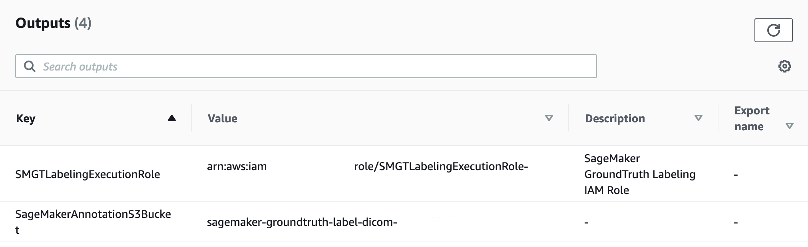
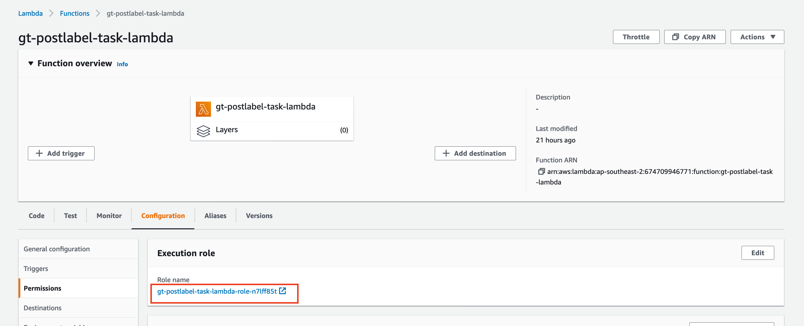
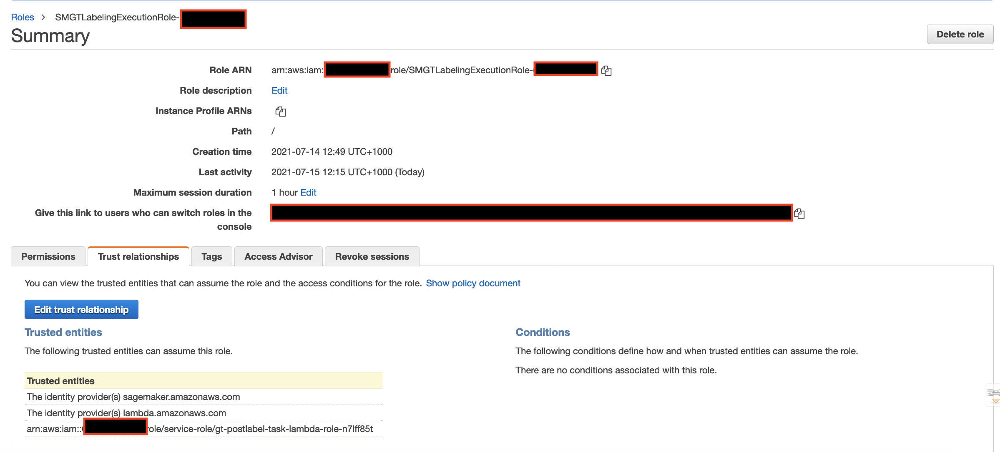
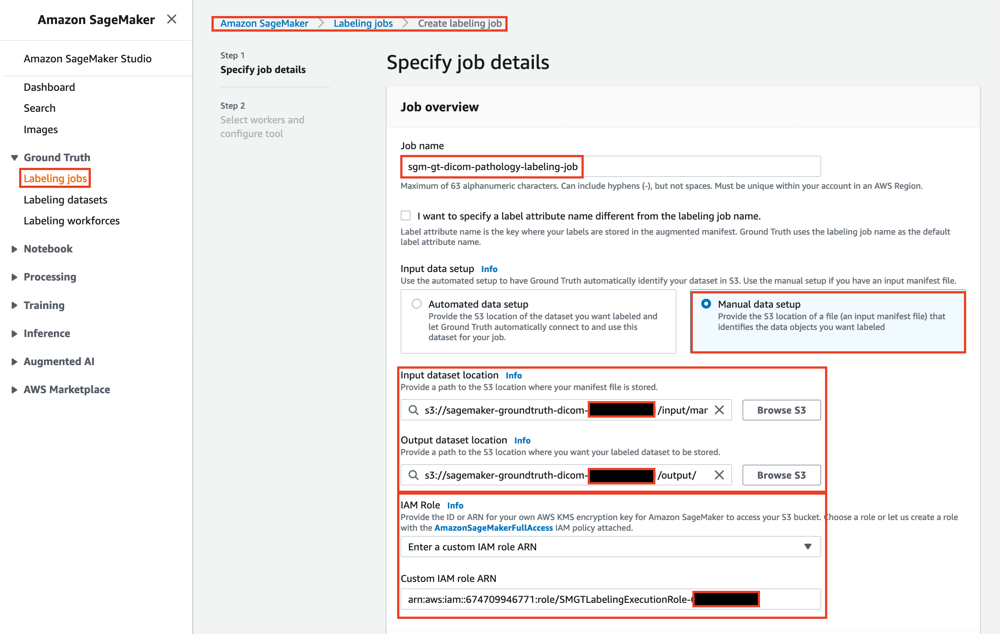
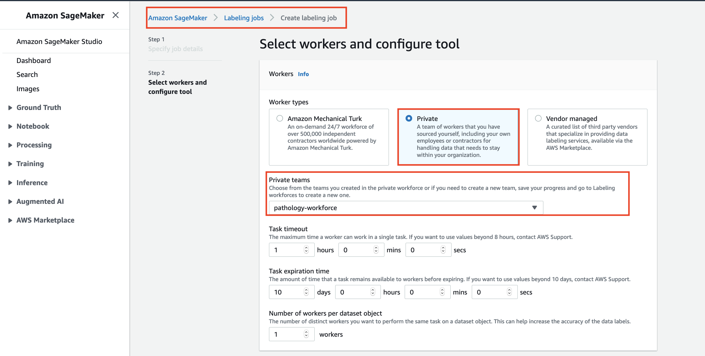
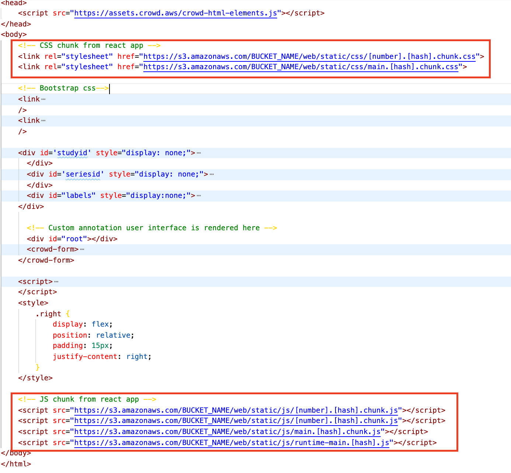
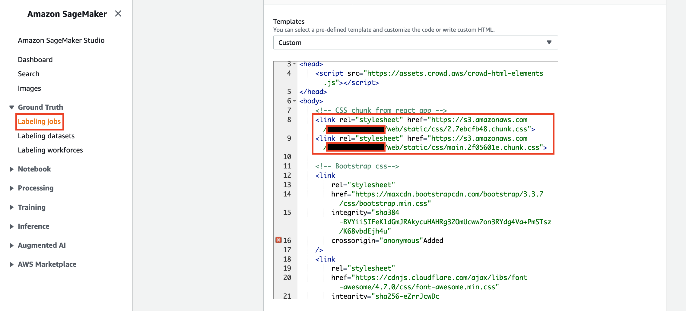
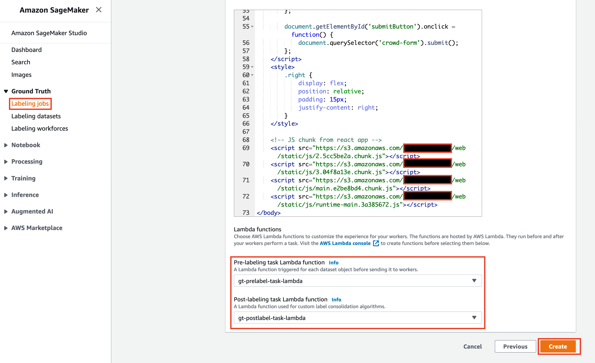
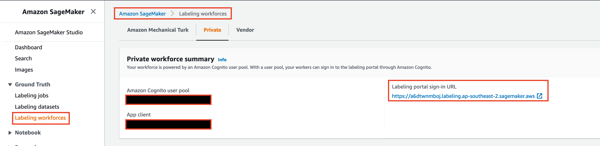

# Annotate Medical Images in Groundtruth using DICOM Microscopic Viewer Library

This project will help you integrate a web based app using DICOM Microscopic viewer library with Sagemaker Groundtruth to annotate and label the high resolution DICOM images.


## Step 1: Integrate DICOM Microscopic viewer to integrate in a react app

1. Clone GitHub repo 
```
git clone https://github.com/rahulbaisla/annotate-medical-images-in-sagemaker-groundtruth-using-dicom-microscopic-viewer.git
```

2. cd annotate-medical-images-in-sagemaker-groundtruth-using-dicom-microscopic-viewer

3. npm install

4. npm run build
```
...
Creating an optimized production build...
Compiled with warnings.
...
...
File sizes after gzip:

  458.03 KB  build/static/js/2.4c7432ef.chunk.js
  3.5 KB     build/static/css/main.d874bebe.chunk.css
  2.81 KB    build/static/js/main.12df130f.chunk.js
  1.25 KB    build/static/css/2.a55abcc0.chunk.css
  802 B      build/static/js/runtime-main.78a9979a.js
```

5. App is ready to be integrated with Sagemaker groundtruth.

6. Upload the generated artifacts to a public S3 bucket. The generated code will be referenced in the custom Groundtruth HTML template later.
```
Make a folder structure like this to save JS and CSS files seperately.

    s3://BUCKET_NAME/web/static/js/
    s3://BUCKET_NAME/web/static/css/
```

## Step 2: Set up Bucket and Execution role for Labeling Job

1. Navigate to AWS CloudFormation console

2. Choose **Upload a template file** to upload the [sagemaker_resources.yaml](src/resources/sagemaker_resources.yaml) file  and follow the step to provision the Execution role and S3 bucket

3. Enter Stack Name : **gt-dicom-resources**

4. Navigate to Output tab and take a note of the outputs of CFN deployment i.e. SMGTLabelingExecutionRole and SageMakerAnnotationS3Bucket names:



4. Create 2 folders in S3 bucket created : input and output

5. Upload the file [manifest.json](src/data/manifest.json) to input folder in S3 Bucket created identified

## Step 3: Set up pre and post processing lambda

### Pre Label Lambda
1. Navigate to AWS Console and select Create Function

2. Enter following configurations

Function name : **gt-prelabel-task-lambda**
Runtime : **Python3.8**
Execution role : **Create a new role with basic Lambda permissions**

3. Select Create

4. Scroll to the Code Source pane, choose Upload from and then . zip file.

5. Upload the [gt-prelabel-task-lambda.zip](src/lambda/gt-prelabel-task-lambda.zip)


### Post Label Lambda
1. Navigate back to AWS Console and select Create Function

2. Enter following configurations

Function name : **gt-postlabel-task-lambda**
Runtime : **Python3.8**
Execution role : **Create a new role with basic Lambda permissions**

3. Select Create

4. Scroll to the Code Source pane, choose Upload from and then . zip file.

5. Upload the [gt-postlabel-task-lambda.zip](src/lambda/gt-postlabel-task-lambda.zip)


6. Go to Configuration tab and click on the role to launch IAM console and copy the IAM role ARN.


7. IN IAM console trace the SMGTLabelingExecutionRole created in step 2 (Set up Bucket and Execution role for Labeling Job)  and edit the trust policy to add the lambda role execution ARN identified in step 6 above 



The trust policy should look like this
```
{
  "Version": "2012-10-17",
  "Statement": [
    {
      "Effect": "Allow",
      "Principal": {
        "Service": "sagemaker.amazonaws.com"
      },
      "Action": "sts:AssumeRole"
    },
    {
      "Effect": "Allow",
      "Principal": {
        "Service": "lambda.amazonaws.com",
        "AWS": "arn:aws:iam::ACCOUNT_ID:role/service-role/LAMBDA_ROLE_ARN"
      },
      "Action": "sts:AssumeRole"
    }
  ]
}
```
## Step 4: Create Custom Label Job in SageMaker GroundTruth
1. Create workforce of private workers and add to a team. 


2. Create a SageMaker GroundTruth Labeling Job

- Enter a name for job : **sgm-gt-dicom-pathology-labeling-job**

- Select Manual Input data set up 

- Specify the input and output data locations in SageMakerAnnotationS3Bucket plus the SMGTLabelingExecutionRole as IAM role for labeling job 



- Select Task Type as custom


- Next, For workers configuration select the previously created private team.


- Copy the content in template.liquid.html and edit in a text editor before using.
Replace the highlighted path with the path where you uploaded the static js/css files in **Step 1**.


- Paste the updated template into the custome HTML template editor




- Configure Pre and Post Label Lambda function




## Step 5: Working on Labeling Job
1. Navigate to Labeling Workforces from AWS Console and copy the labeling portal URL


2. Launch the URL and start working on the labeling job.