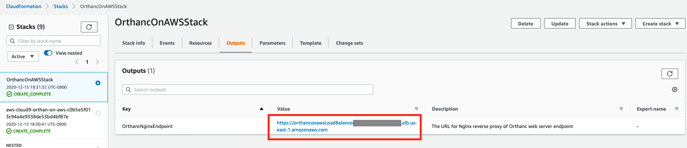
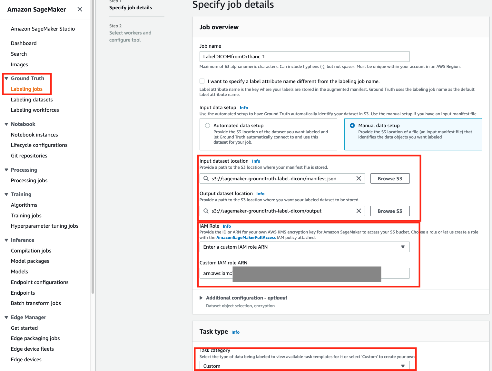
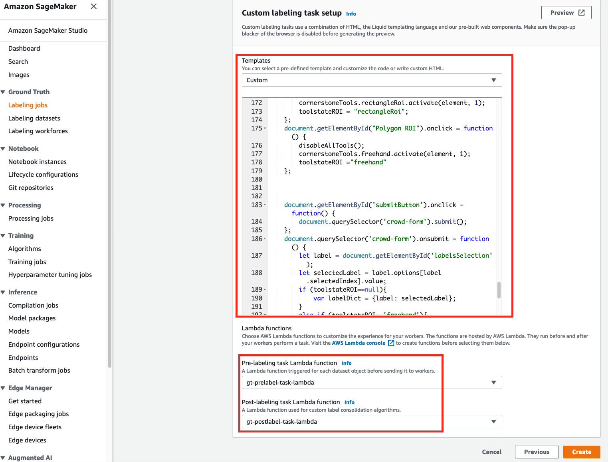

## Annotate Medical Images in DICOM Server and Build ML models using Amazon SageMaker

## Deployment Steps

### Pre-requisite

You will need two public subnets and two private subnets in a given Virtual Private Cloud (VPC). You can either follow this [blog post](https://aws.amazon.com/blogs/database/deploy-an-amazon-aurora-postgresql-db-cluster-with-recommended-best-practices-using-aws-cloudformation/) to deploy the network infrastructure first, or deploy the VPC network infrastructure using this [CloudFormation template](https://docs.aws.amazon.com/codebuild/latest/userguide/cloudformation-vpc-template.html) (Optional)

### Deploy Orthanc DICOM Server on AWS ECS

To deploy the CloudFormation (CFN) on AWS console, using 1-click deployment button:

The required information will be EC2 Key pair and network infrastructure.

After the CFN stack is successfully created, the Orthanc endpoint URL will be available in the Outputs tab like 

### Upload DICOM images to Orthanc 

Orthanc supports WADO-RS with its [RESTful API](https://book.orthanc-server.com/users/rest.html). You can upload a DICOM image from local folder:

`curl -u orthanc:orthanc -X POST https://<Orthanc URL>/instances --data-binary @<DICOM Image>.dcm -k`

After uploaded, check the instance id assigned:
`curl -u orthanc:orthanc https://<Orthanc URL>/instances -k`

Then put instance IDs in source field of manifest.json. Assuming here is the output of the previous command (list of DICOM instances):
`[  
   "502b0a4b-5cb43965-7f092716-bd6fe6d6-4f7fc3ce",  
   "af163634-5f8009c8-a941f2a2-4d108bea-119181b5",  
   "3e9562ab-3bd7b304-e003d1f8-0fe2e8f5-e6af3f36"   
]`  
The manifest.json file will look at [this](https://github.com/aws-samples/annotate-medical-images-in-dicom-server-and-build-ml-models-on-amazon-sagemaker/blob/main/sagemaker-groundtruth/manifest.json).

### Deploy the pre and post labeling Lambda functions

click the button below to deploy both PreLabelTaskLambda and PostLabelTaskLambda functions

Fill the parameter PreLabelLambdaSourceEndpointURL with the Orthanc endpoint URL from previous step.

### Create Custom Label Job in SageMaker GroundTruth

- Create a S3 bucket and upload the input manifest.json file generated earlier.    
- Create a SageMaker GroundTruth Labeling Job, and specify the input and output data locations at Step 1 of job creation.  
 
- Copy the [content in template.liquid.html](https://github.com/aws-samples/annotate-medical-images-in-dicom-server-and-build-ml-models-on-amazon-sagemaker/blob/main/sagemaker-groundtruth/template.liquid.html) to the Custom Template text field as well as configure the pre-labeling and post-labeling Lambda functions deployed earlier.

After configuring the custom labeling task, click on the Preview button, you will see the following preview

## Security

See [CONTRIBUTING](CONTRIBUTING.md#security-issue-notifications) for more information.

## License

This library is licensed under the MIT-0 License. See the LICENSE file.
