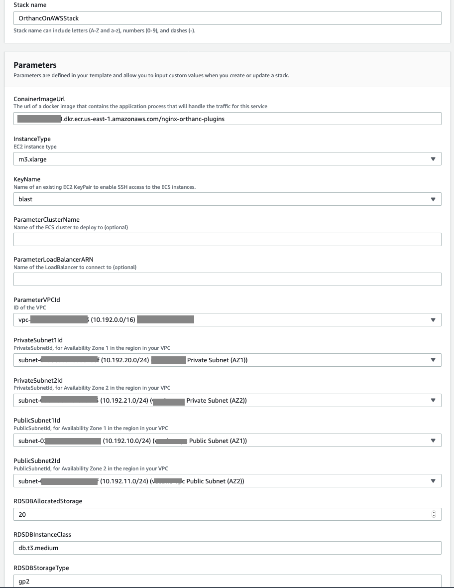
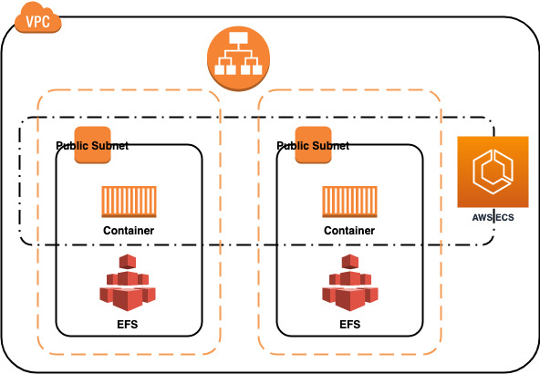

## Orthanc on AWS 

### Disclaimer

Orthanc is licensed GPL/AGPLv3. This container was built from the [open source version of Orthanc](https://github.com/jodogne/OrthancDocker). This deployment is only for Amazon SageMaker GroundTruth labeling demo and only port 443 for HTTPS is open for the Orthanc container. 

If you want to build your own container image and push the container image to [Amazon Elastic Container Registry](https://aws.amazon.com/ecr/), run the following script: `./build_and_push.sh`. 

Alternatively, you can build docker container `docker build -t <tag> .` and push it to container repository manually. The Orthanc docker image was derived from [this document](https://book.orthanc-server.com/users/docker.html). The CORS headers were injected in Nginx reverse proxy on top of it.

After pushing the container image to ECR, copy the image URI (like <AWS Account ID>.dkr.ecr.<AWS Region>.amazonaws.com/nginx-orthanc-plugins]) that will be used in the Cloudformation deployment.

You can deploy the CloudFormation (CFN) stack on AWS console using `orthanc-ec2-cfn-tempalte.yaml` template in this folder, by filling up the parameters like:   
 

Or you can deploy the CFN stack using AWS CLI:

`aws cloudformation deploy --capabilities CAPABILITY_IAM --template-file ./orthanc-ec2-rds-cfn-tempalte.yaml --stack-name <stackname> --parameter-overrides ConainerImageUrl=<imageURI> KeyName=<EC2 Key> ParameterVPCId=<VPC ID> PrivateSubnet1Id=<Private Subnet in AZ1> PrivateSubnet2Id=<Private Subnet in AZ2> PublicSubnet1Id=<Public Subnet in AZ1> PublicSubnet2Id=<Public Subnet in AZ2> --profile <profilename> ParameterLoadBalancerARN=<LB ARN or Empty value for creating new one> ParameterClusterName=<ECS Cluster Name or Empty value for creating new one>`

Here is the architecture diagram of HA deployment of the Orthanc on AWS:  
 
